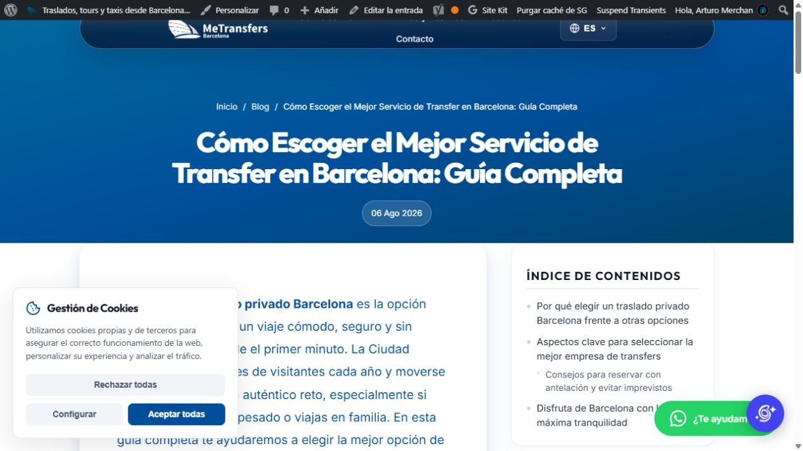

# Resultado final de la revisión y corrección del blog mediante MCP

**Trabajo iniciado el 1 de octubre y terminado el 2 de octubre de 2026, según la fecha del usuario. Estado: 140 slugs corregidos en producción y 866 URLs verificadas sin fallos pendientes.**

## 1. Resultado y conexión comprobada

La conexión **MCP Server For WordPress** funciona contra **https://metransfers.es** con un usuario administrador y 202 capacidades. Se comprobaron WordPress 7.1.2 y PHP 8.2.34 en producción. Las entradas se leyeron y editaron mediante el MCP; las redirecciones se configuraron en el administrador de **Yoast SEO Premium**, ya instalado.

Se revisaron las **149 entradas publicadas**, las 104 páginas publicadas, las 97 rutas y los estados no publicados/papelera para descartar conflictos. Se corrigieron **140 slugs** que no correspondían al tema actual y se conservaron los **9 slugs coherentes**.

Este acceso a WordPress no constituye una conexión al panel ni a los archivos de SiteGround. El editor de archivos del tema denegó el acceso; la solución aplicada utiliza el gestor existente de Yoast.

## 2. Hallazgos y causa

| Hallazgo inicial | Entradas |
|---|---:|
| Slug que describía un tema distinto del título y cuerpo | 138 |
| Desajuste parcial de enfoque | 2 |
| Slug coherente con el tema actual | 9 |
| Bloques defectuosos que repetían contenido al renderizarlo | 35 |
| Extracto manual que conservaba el tema antiguo | 4 |

WordPress almacena título, cuerpo y slug en campos independientes. El estado encontrado es compatible con sustituir el título y el cuerpo sin actualizar el slug. La evidencia no identifica a una persona o herramienta responsable.

Los 35 cuerpos defectuosos tenían comentarios de bloques mal emparejados. La entrada 29569 también incluía un bloque `wp:post-content` dentro de su propio contenido. Su revisión anterior contiene exactamente el mismo cuerpo defectuoso que la copia inicial; el problema ya estaba guardado antes de esta intervención.

La [auditoría inicial](AUDITORIA-BLOG-2026-10-01.md) conserva el diagnóstico previo. El [inventario final de las 149 entradas](BLOG-URLS-FINAL-2026-10-02.csv) recoge los slugs antiguos, los actuales y las URLs de ambos idiomas.

## 3. Cambios aplicados directamente en producción

| Corrección | Resultado |
|---|---|
| 140 slugs correspondientes al título y tema actual | Aplicados y verificados |
| 9 slugs ya coherentes | Conservados |
| Bloques equilibrados en 35 artículos | Reparados; referencias únicas conservadas |
| Copias idénticas y bloque recursivo de 29569 | Retirados |
| Extractos de 29735, 29744, 29745 y 29746 | Corresponden al tema actual |
| Texto de 1038 | Dirección aeropuerto El Prat → Barcelona corregida |
| Título de 29566 | «Cómo Planificar un Viaje Perfecto en Barcelona: Guía Completa» |
| Redirecciones antiguas españolas e inglesas | 301 al artículo correcto, conservando campañas |
| Método de redirección de Yoast | PHP, guardado y comprobado |
| Sitemap de entradas | 149 URLs actuales y la portada del blog |

Las reparaciones de contenido afectan a **41 entradas**: 36 cuerpos, 4 extractos manuales y 1 título. Estos cambios se solapan con los 140 cambios de slug.

El extracto almacenado de 29569 sigue vacío: WordPress genera su resumen desde el cuerpo limpio. Se conservaron los enlaces comerciales a `transfersinbarcelona.com/es`; la revisión no demuestra que sean ajenos al negocio.

### Ejemplos de URLs corregidas

| ID | Slug antiguo | Slug actual |
|---|---|---|
| 29746 | `lonjas-de-pescado-en-la-costa-de-cataluna` | `como-escoger-el-mejor-servicio-de-transfer-en-barcelona-guia-completa` |
| 29745 | `barcelona-seniors-comodidad-accesibilidad-vehiculos` | `diferencias-entre-servicios-de-traslado-taxi-vs-transfer-privado-en-barcelona` |
| 29735 | `recuperar-el-iva-en-el-aeropuerto` | `beneficios-de-usar-un-servicio-de-traslado-privado-en-barcelona` |
| 29572 | `tour-privado-por-los-pueblos-medievales-de-cataluna-desde-barcelona` | `10-consejos-para-elegir-el-mejor-servicio-de-traslado-en-barcelona` |

### Artículo con mayor repetición

| Medida de 29569 | Antes | Después |
|---|---:|---:|
| Caracteres del HTML público del cuerpo | 3.949.474 | 2.916 |
| Bloques de texto mostrados | 11.301 | 9 |
| Textos distintos | 9 | 9 |

## 4. Redirecciones y correcciones durante la verificación

La primera migración pasó en español, pero los enlaces ingleses antiguos devolvían 404. Se detuvo el lote y se restauraron sus 39 slugs, manteniendo las reparaciones de contenido. Las 78 URLs originales ES/EN volvieron a responder 200.

El router inglés del tema utiliza `mt_lang` y `mt_page`; la redirección nativa de slugs antiguos requiere `name`. Esa condición puede consultarse en el [código oficial de WordPress](https://developer.wordpress.org/reference/functions/wp_old_slug_redirect/).

Yoast tenía seleccionado el método de servidor con un archivo separado. Guardar una regla no producía una redirección pública. Al seleccionar y guardar **PHP**, la prueba devolvió 301. Las reglas simples no cubrían las cadenas de consulta; se añadieron reglas exactas para conservarlas. Véase la [documentación de Yoast sobre parámetros y redirecciones](https://yoast.com/help/url-redirects-with-encoded-characters/).

Se migraron los artículos por grupos, comparando su estado antes y después. Las protecciones inglesas temporales se convirtieron en reglas permanentes hacia la versión inglesa. **No quedan reglas 302 de esta intervención.**

El primer pase de 866 URLs detectó una redirección incorrecta para 29572: juntar `$1` con el slug que empieza por `10-` generaba una referencia numérica ambigua. Se sustituyó por reglas independientes para español e inglés, con el destino numérico escrito literalmente. Las seis URLs de ese artículo se repitieron y pasaron. El [manual de PHP](https://www.php.net/manual/en/function.preg-replace.php) explica la ambigüedad de las referencias seguidas de dígitos; la solución final evita esa concatenación en Yoast.

Estado guardado de Yoast, leído desde su interfaz:

- **153 reglas simples**: 142 de tipo 301 y las 11 reglas 410 anteriores.
- **278 reglas regex**, todas 301, con destinos contrastados.
- **12 reglas históricas conservadas**: 11 disposiciones 410 y una redirección de categoría.
- **419 reglas de esta migración**, reproducibles en [REDIRECCIONES-BLOG-2026-10-02.csv](REDIRECCIONES-BLOG-2026-10-02.csv).
- Método PHP seleccionado y guardado.

El CSV no incluye las 12 reglas históricas ajenas a esta migración. La [guía operativa](CORRECCION-REDIRECCIONES-BLOG-EN-2026-10-01.md) incluye los patrones y la configuración aplicada.

## 5. Verificación final

| Comprobación | Resultado |
|---|---:|
| URLs antiguas ES/EN, con y sin parámetros | 560 / 560 con 301 y destino exacto |
| URLs nuevas ES/EN | 280 / 280 con 200 |
| URLs ES/EN de los 9 slugs conservados | 18 / 18 con 200 |
| Portada, reservas, selección de vehículo, pago y hoteles | 8 / 8 con 200 |
| Total de URLs distintas verificadas | **866 / 866** |
| Entradas publicadas conservadas | 149 / 149 |
| Canonical de entradas españolas | 149 / 149 correctos |
| Directivas robots | 149 / 149 conservadas |
| URLs de entradas presentes en el sitemap | 149 / 149 |

Durante la migración se compararon título, texto renderizado completo, extracto, autor, fecha de publicación, estado, categorías y etiquetas. Los ocho campos coinciden con el estado posterior a las reparaciones de contenido. Los primeros cambios también se contrastaron con lecturas autenticadas de los cuerpos originales.

Los controles comerciales son **comprobaciones de carga**, no una compra real ni un pago de prueba. Las reglas se limitan a los slugs exactos del blog; el formulario de reservas, los puntos de venta, las cuentas de pago y las claves de Google no se editaron.

Los canonical y las directivas robots se conservaron para mantener la coherencia de indexación. Esta intervención no certifica posiciones en Google ni la traducción completa de los 149 artículos ingleses. En la muestra inglesa revisada, el título y la navegación están traducidos, pero hay texto principal todavía en español; queda como cuestión editorial independiente.

Evidencia resumida: [VERIFICACION-BLOG-2026-10-02.json](VERIFICACION-BLOG-2026-10-02.json).



## 6. Copia de seguridad y diarios

Carpeta externa al repositorio:

`C:/Users/merch/OneDrive/Escritorio/metransfers-backups/blog-2026-10-01-mcp/`

Archivos principales:

- `all-posts-before.json`: cuerpos y campos SEO originales de las 149 entradas.
- `all-posts-after-content.json`: estado esperado después de reparar los cuerpos.
- `slug-rollback-journal.json`: restauración inicial de los 39 slugs.
- `content-applied-journal.json`: guardados de contenido y comprobaciones.
- `final-slug-journal-140.json`: migración definitiva.
- `yoast-rules-before-php-method.json`: configuración anterior al cambio de método.
- `yoast-final-verification.json`: contraste de reglas guardadas.
- `first-full-http-results.tsv`: primer pase y caso numérico detectado.
- `final-http-results.tsv` y `final-http-verification.json`: respuestas y contraste final.
- `final-slug-content-verification.json`: contraste de las 149 entradas.

SHA-256 de la copia original, comprobado sin cambios:

`02A0D492629AE46553BA95DB31F4FDFE5DDB0BF3987836A2C1130ACA8BC4C530`

Los cuerpos completos y los datos de respaldo se mantienen fuera de Git. Una restauración debe comprobar las ediciones posteriores para no sobrescribir trabajo nuevo.

## 7. Código guardado en el repositorio y alcance

La solución aplicada a esta migración es **Yoast Premium en modo PHP**, con el mapa CSV de URLs. No requirió instalar el archivo del tema preparado.

El código `app/SEO/BlogSlugRedirects.php` queda en el repositorio como alternativa para recuperar futuros slugs ingleses mediante `_wp_old_slug`. Su despliegue en producción sigue pendiente de acceso a los archivos activos. Una futura modificación de permalink necesita su regla inglesa correspondiente mientras ese fallback no esté instalado.

El generador `tools/prepare-blog-block-repair.php` reconstruye propuestas desde el respaldo autenticado, conserva referencias y rechaza HTML interactivo. No escribe en WordPress.

Validación del código ya integrado mediante los PR [64](https://github.com/merchandev/metransfers.es/pull/64) y [65](https://github.com/merchandev/metransfers.es/pull/65):

- PHPUnit: **107 pruebas y 947 aserciones**, sin fallos; una deprecación existente del ejecutor.
- PHPStan y WPCS: sin errores.
- Preparación reproducible: **35 propuestas y 0 rechazos**.
- Los **8 controles de CI** aprobaron, incluidas las integraciones con WordPress 6.8.6, 7.0.2 y 7.1.

A continuación se conservan las métricas de los 35 artículos reparados y el código completo utilizado.

## 8. Artículos con bloques reparados

| ID | Bloques públicos antes | Bloques públicos después |
|---|---:|---:|
| 1000 | 43 | 10 |
| 1012 | 143 | 12 |
| 1013 | 77 | 9 |
| 1014 | 76 | 11 |
| 1017 | 55 | 11 |
| 1019 | 76 | 12 |
| 1020 | 69 | 11 |
| 1021 | 50 | 10 |
| 1037 | 65 | 12 |
| 1039 | 144 | 13 |
| 1041 | 70 | 13 |
| 1044 | 59 | 11 |
| 1051 | 55 | 11 |
| 18057 | 58 | 11 |
| 18188 | 52 | 10 |
| 24131 | 55 | 11 |
| 27253 | 120 | 11 |
| 27276 | 52 | 10 |
| 27345 | 62 | 12 |
| 27360 | 62 | 12 |
| 27442 | 62 | 12 |
| 27465 | 72 | 12 |
| 27586 | 117 | 12 |
| 27622 | 31 | 10 |
| 27643 | 31 | 9 |
| 27656 | 55 | 10 |
| 27807 | 17 | 12 |
| 27815 | 92 | 17 |
| 27826 | 43 | 10 |
| 27836 | 255 | 16 |
| 27864 | 43 | 10 |
| 27870 | 107 | 15 |
| 27885 | 77 | 13 |
| 29561 | 143 | 12 |
| 29569 | 11301 | 9 |

## 9. Código completo de las redirecciones

Archivo: `app/SEO/BlogSlugRedirects.php`. **Preparado y probado localmente; pendiente de instalación en producción.**

```php
<?php
namespace MeTransfers\SEO;

/**
 * 301s a corrected blog post slug from its old, unrelated one (see
 * tools/fix-blog-slugs.php). Deliberately independent of LegacyUrlMap:
 * the mapping is generated data, not a fixed pattern, and only fires on an
 * actual 404 so it is safe regardless of whether this code deploys before
 * or after the WP-CLI script renames the posts — a URL that still resolves
 * to a real post is never intercepted.
 */
final class BlogSlugRedirects {
	const OPTION = 'mt_blog_slug_redirects';

	public function register() {
		add_action( 'template_redirect', array( __CLASS__, 'maybeRedirect' ), 5 );
	}

	public static function maybeRedirect() {
		if ( ! is_404() || is_admin() || wp_doing_ajax() || ( defined( 'REST_REQUEST' ) && REST_REQUEST )
			|| ! in_array( $_SERVER['REQUEST_METHOD'] ?? 'GET', array( 'GET', 'HEAD' ), true ) ) {
			return;
		}
		$map     = get_option( self::OPTION, array() );
		$request = isset( $_SERVER['REQUEST_URI'] ) ? wp_unslash( $_SERVER['REQUEST_URI'] ) : '/';
		$target  = self::targetForRequest( $request, is_array( $map ) ? $map : array() );
		if ( null === $target ) {
			$target = self::nativeEnglishTargetForRequest( $request );
		}
		if ( null === $target ) {
			return;
		}
		wp_safe_redirect( home_url( $target ), 301 );
		exit;
	}

	/**
	 * The language router uses mt_page, so WordPress's name-based old-slug
	 * redirect cannot resolve /en/ links after an ordinary post update.
	 * Read core's recorded slug history without changing SEO approvals.
	 */
	public static function nativeEnglishTargetForRequest( string $request ): ?string {
		if ( 'en' !== \MeTransfers\I18n\Language::detectFromUri( $request ) ) {
			return null;
		}
		$slug = \MeTransfers\I18n\Language::pathWithoutLanguage( $request );
		// Blog permalinks on this site have exactly one segment. Never match
		// nested route, checkout, admin, feed or API paths.
		if ( '' === $slug || false !== strpos( $slug, '/' ) || ! preg_match( '/^[a-z0-9%_-]+$/i', $slug ) ) {
			return null;
		}
		if ( in_array( $slug, array( 'pago', 'reservaciones', 'seleccionar-vehiculo', 'reservas-metransfers', 'reservas-hotel', 'gracias', 'contacto', 'wp-admin', 'wp-json', 'feed' ), true ) ) {
			return null;
		}
		if ( UrlPolicy::postForPath( $slug ) ) {
			return null;
		}
		$matches = get_posts(
			array(
				'post_type'      => 'post',
				'post_status'    => 'publish',
				'posts_per_page' => 2,
				'fields'         => 'ids',
				'meta_key'       => '_wp_old_slug',
				'meta_value'     => $slug,
				'no_found_rows'  => true,
			)
		);
		// An ambiguous history must not send visitors to an arbitrary post.
		if ( 1 !== count( $matches ) ) {
			return null;
		}
		$post = get_post( (int) $matches[0] );
		if ( ! $post || 'post' !== $post->post_type || 'publish' !== $post->post_status
			|| '' !== $post->post_password || $slug === $post->post_name ) {
			return null;
		}
		$target = (string) $post->post_name;
		if ( '' === $target || ! preg_match( '/^[a-z0-9%_-]+$/i', $target ) ) {
			return null;
		}
		$query = parse_url( $request, PHP_URL_QUERY );
		return '/en/' . $target . '/' . ( is_string( $query ) && '' !== $query ? '?' . $query : '' );
	}

	public static function targetForRequest( string $request, array $map ): ?string {
		$path = \MeTransfers\I18n\Language::pathWithoutLanguage( $request );
		if ( '' === $path || ! isset( $map[ $path ] ) || ! is_string( $map[ $path ] ) ) {
			return null;
		}
		$target = trim( $map[ $path ], '/' );
		$post   = UrlPolicy::postForPath( $target );
		// A public article remains a valid redirect destination even when its
		// owner set noindex or a manual canonical. Those SEO choices must not
		// break inbound links after a slug correction.
		if ( $target === $path || ! $post || 'post' !== $post->post_type
			|| 'publish' !== $post->post_status || '' !== (string) ( $post->post_password ?? '' ) ) {
			return null;
		}
		$language = \MeTransfers\I18n\Language::detectFromUri( $request );
		$prefix   = 'en' === $language && UrlPolicy::eligibleTarget( $target, 'en' ) ? '/en/' : '/';
		$query    = parse_url( $request, PHP_URL_QUERY );
		return $prefix . $target . '/' . ( is_string( $query ) && '' !== $query ? '?' . $query : '' );
	}
}
```

## 10. Código utilizado para preparar los cuerpos limpios

Archivo: `tools/prepare-blog-block-repair.php`. Genera un JSON de propuestas desde una copia autenticada; **no escribe en WordPress**. Las propuestas se aplicaron posteriormente con el MCP, leyendo y verificando cada entrada.

```php
<?php
declare(strict_types=1);
/**
 * Proposes block repairs from an authenticated raw post_content backup.
 * Never writes to WordPress. Usage:
 * php tools/prepare-blog-block-repair.php backup.json proposal.json 1000,1012,...
 */
if (PHP_SAPI !== 'cli') { exit; }
if ($argc < 4 || !is_file($argv[1])) {
    fwrite(STDERR, "Usage: php prepare-blog-block-repair.php backup.json proposal.json comma-separated-ids\n");
    exit(1);
}
function htmlRoot(string $html): array {
    $doc = new DOMDocument();
    $doc->loadHTML('<?xml encoding="utf-8"?><html><body><div id="audit-root">' . $html . '</div></body></html>', LIBXML_NONET);
    return [$doc, $doc->getElementById('audit-root')];
}
function references(DOMNode $root): array {
    $result = [];
    foreach (['a' => 'href', 'img' => 'src'] as $tag => $attribute) {
        foreach ($root->getElementsByTagName($tag) as $node) { $result[$tag . ':' . $node->getAttribute($attribute)] = true; }
    }
    ksort($result);
    return array_keys($result);
}
function wrapNode(DOMDocument $doc, DOMNode $node): string {
    $html = trim($doc->saveHTML($node));
    $name = $node->nodeName;
    if ($name === 'p') { $block = 'paragraph'; $attrs = ''; }
    elseif (preg_match('/^h([1-6])$/', $name, $matches)) {
        $block = 'heading'; $attrs = $matches[1] === '2' ? '' : ' ' . json_encode(['level' => (int) $matches[1]]);
    } elseif ($name === 'ul' || $name === 'ol') {
        $block = 'list'; $attrs = $name === 'ol' ? ' {"ordered":true}' : '';
        $html = preg_replace('/(<li(?:\s[^>]*)?>)/', '<!-- wp:list-item -->$1', $html);
        $html = str_replace('</li>', '</li><!-- /wp:list-item -->', $html);
    } elseif ($name === 'figure' && $node instanceof DOMElement && str_contains($node->getAttribute('class'), 'wp-block-image')) {
        $block = 'image'; $imageAttrs = [];
        if (preg_match('/(?:^|\s)size-([\w-]+)/', $node->getAttribute('class'), $size)) { $imageAttrs['sizeSlug'] = $size[1]; }
        if (preg_match('/(?:^|\s)align(left|right|center|wide|full)(?:\s|$)/', $node->getAttribute('class'), $align)) { $imageAttrs['align'] = $align[1]; }
        $image = $node->getElementsByTagName('img')->item(0);
        if ($image && preg_match('/\bwp-image-(\d+)\b/', $image->getAttribute('class'), $imageId)) { $imageAttrs['id'] = (int) $imageId[1]; }
        $attrs = $imageAttrs ? ' ' . json_encode($imageAttrs) : '';
    } elseif ($name === 'figure' && $node instanceof DOMElement && str_contains($node->getAttribute('class'), 'wp-block-table')) {
        $block = 'table'; $attrs = '';
    } else { throw new RuntimeException('Unsupported top-level node: ' . $name); }
    return '<!-- wp:' . $block . $attrs . " -->\n" . $html . "\n<!-- /wp:" . $block . ' -->';
}
libxml_use_internal_errors(true);
$snapshot = json_decode(file_get_contents($argv[1]), true, 512, JSON_THROW_ON_ERROR);
$eligible = isset($argv[3]) ? array_map('intval', explode(',', $argv[3])) : [];
$repairs = []; $refused = [];
foreach ($snapshot['posts'] as $post) {
    $raw = $post['content'];
    if (!str_contains($raw, 'wp:post-content') && !in_array($post['id'], $eligible, true)) { continue; }
    try {
        preg_match_all('/<!--\s*\/?wp:([\w-]+(?:\/[\w-]+)?)/', $raw, $blocks);
        $unexpected = array_diff(array_unique($blocks[1]), ['paragraph', 'heading', 'list', 'list-item', 'image', 'table', 'post-content']);
        if ($unexpected) { throw new RuntimeException('Other blocks present: ' . implode(', ', $unexpected)); }
        if (preg_match('/<(?:form|input|button|iframe|script)\b|\[[a-zA-Z][\w-]*(?:\s|\])/', $raw)) { throw new RuntimeException('Interactive HTML or shortcode present'); }
        $html = preg_replace('/<!--\s*\/?wp:[\s\S]*?-->/', '', $raw);
        [$doc, $root] = htmlRoot($html);
        $unique = []; $sourceCount = 0;
        foreach ($root->childNodes as $index => $node) {
            if ($node instanceof DOMText && trim($node->textContent) === '') { continue; }
            $sourceCount++;
            $outer = trim($doc->saveHTML($node));
            $signature = hash('sha256', preg_replace('/>\s+</', '><', $outer));
            // Last occurrences retain the order of the complete final article,
            // after the malformed nested copies prepended fragments to it.
            $unique[$signature] = ['index' => $index, 'node' => $node];
        }
        uasort($unique, fn($a, $b) => $a['index'] <=> $b['index']);
        $content = implode("\n\n", array_map(fn($item) => wrapNode($doc, $item['node']), array_values($unique)));
        [$cleanDoc, $cleanRoot] = htmlRoot(preg_replace('/<!--\s*\/?wp:[\s\S]*?-->/', '', $content));
        if (references($root) !== references($cleanRoot)) { throw new RuntimeException('Link or image reference set changed'); }
        $beforeText = [];
        foreach ($unique as $item) { $beforeText[] = trim(preg_replace('/\s+/u', ' ', $item['node']->textContent)); }
        $afterText = [];
        foreach ($cleanRoot->childNodes as $node) {
            if ($node instanceof DOMText && trim($node->textContent) === '') { continue; }
            $afterText[] = trim(preg_replace('/\s+/u', ' ', $node->textContent));
        }
        if ($beforeText !== $afterText) { throw new RuntimeException('Unique text changed'); }
        $repairs[] = ['id' => $post['id'], 'title' => $post['title'], 'expected_modified' => $post['modified'], 'expected_raw_sha256' => hash('sha256', $raw), 'old_characters' => mb_strlen($raw), 'new_characters' => mb_strlen($content), 'original_html_nodes' => $sourceCount, 'unique_html_nodes' => count($unique), 'references' => references($root), 'new_content' => $content];
    } catch (Throwable $error) { $refused[] = ['id' => $post['id'], 'error' => $error->getMessage()]; }
}
$result = ['source' => 'authenticated_raw_post_content', 'status' => 'prepared_not_applied', 'repairs' => $repairs, 'refused' => $refused];
file_put_contents($argv[2], json_encode($result, JSON_UNESCAPED_UNICODE | JSON_UNESCAPED_SLASHES | JSON_PRETTY_PRINT | JSON_THROW_ON_ERROR));
echo json_encode(['repairs' => count($repairs), 'refused' => $refused, 'metrics' => array_map(fn($r) => array_diff_key($r, ['new_content' => 1, 'references' => 1]), $repairs)], JSON_UNESCAPED_UNICODE | JSON_UNESCAPED_SLASHES | JSON_PRETTY_PRINT), "\n";
```

